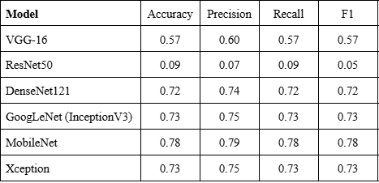
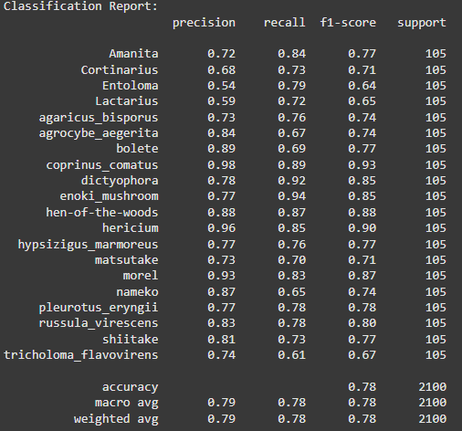
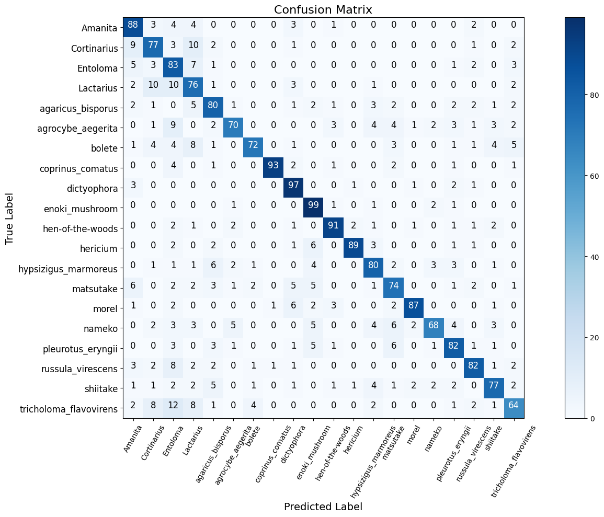

# Mushroom Classification Android App

## Table of Contents
- [Authors](#authors)
- [Problem Background](#problem-background)
- [Data Source](#data-source)
- [Mushroom Species](#mushroom-species)
- [Algorithms](#algorithms)
- [Models Used](#models-used)
- [Results](#results)
- [Android App](#android-app)
- [Source](#source)
- [Lessons Learned](#lessons-learned)
- [Limitations and Future Improvements](#limitations-and-future-improvements)
- [Limitations](#limitations)
- [Future Improvements](#future-improvements)

## Authors
- [@SpellZZZZZ](https://github.com/SpellZZZZZ)
- [@guanhonglai](https://github.com/guanhonglai)
- [@super-mcflurry](https://github.com/super-mcflurry)

## Problem Background
This Android app helps classify mushrooms and determine whether they are poisonous or not. 
It can classify images by either uploading an image file or capturing one using the phone's camera.
With the ability to identify 20 different mushroom species, the app provides users with a way to assess mushroom safety. 
Created as part of a college project, this app offers a practical solution for identifying potentially dangerous mushroom species.

## Data Source
- [Mushrooms classification - Common genus's images](https://www.kaggle.com/datasets/maysee/mushrooms-classification-common-genuss-images)
- Web Scraping

### Mushroom Species
- Amanita
- Cortinarius
- Entoloma
- Lactarius
- Agaricus bisporus
- Agrocybe aegerita
- Bolete
- Coprinus comatus
- Dictyophora
- Enoki mushroom
- Hen-of-the-woods
- Hericium
- Hypsizigus marmoreus
- Matsutake
- Morel
- Nameko
- Pleurotus eryngii
- Russula virescens
- Shiitake
- Tricholoma flavovirens

## Algorithms
We tried multiple pretrained CNN models in the process of building the model.

### Models Used:
- VGG-16
- ResNet50
- DenseNet121
- GoogLeNet (InceptionV3)
- MobileNet
- Xception

## Results
Results of all the CNN Models

Species results of the best model (MobileNet)

Confusion matrix of the species results

## Android App
For the android app, we modified an existing image classification android app from GitHub.

### Source
- [Image-Classification-App-with-Custom-TensorFlow-Model](https://github.com/IJ-Apps/Image-Classification-App-with-Custom-TensorFlow-Model)

## Lessons Learned
### **Lessons Learned:**
- **Importance of Augmentation:** Augmentation techniques (e.g., random rotations and flips) improved the balance between training and validation performance, helping to reduce overfitting by diversifying the training data.
- **Data Augmentation Effectiveness:** Models like DenseNet121 and MobileNet performed well with or without augmentation, while VGG-16, GoogLeNet, and Xception benefited significantly from augmentation in preventing overfitting.

## Limitations and Future Improvements

### **Limitations:**
1. **Limited Data and Environmental Sensitivity:** The model's performance is hindered by a small and potentially biased dataset, which limits its ability to generalize to unknown inputs. Additionally, the model's sensitivity to environmental variations like lighting and orientation affects its recognition accuracy in real-world conditions.
2. **Overfitting and Computational Constraints:** Overfitting due to small datasets and complex models results in poor generalization. Training deep learning models for mushroom recognition requires significant computational resources, which can slow down optimization and limit experimentation with advanced architectures.

### **Future Improvements:**
1. **Data Expansion and Active Learning:** Increasing the dataset by sourcing more varied mushroom images and utilizing active learning algorithms to focus on uncertain samples can improve model adaptability and recognition accuracy.
2. **Enhanced Adaptability and Real-Time Deployment:** Implementing techniques like adaptive normalization to handle environmental changes and using k-fold cross-validation to address overfitting will improve model stability. Additionally, optimizing the system for real-time deployment on resource-constrained devices will make the model practical for field use.
